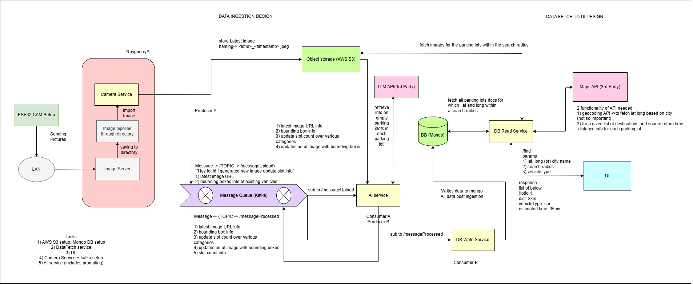
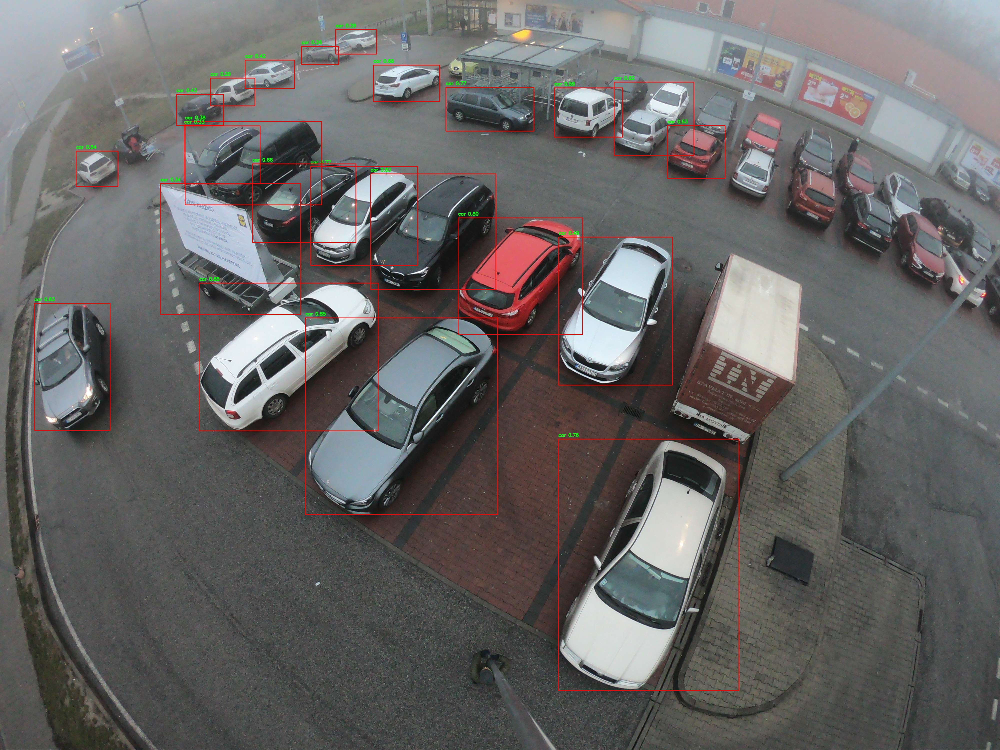
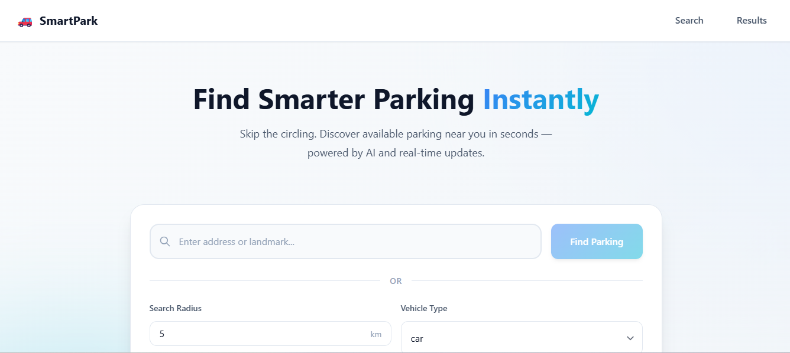
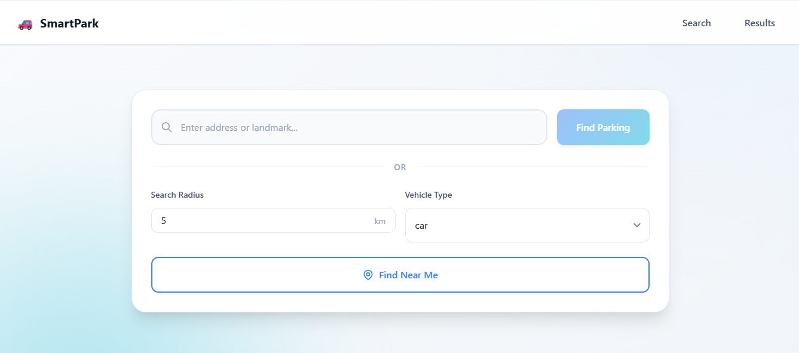
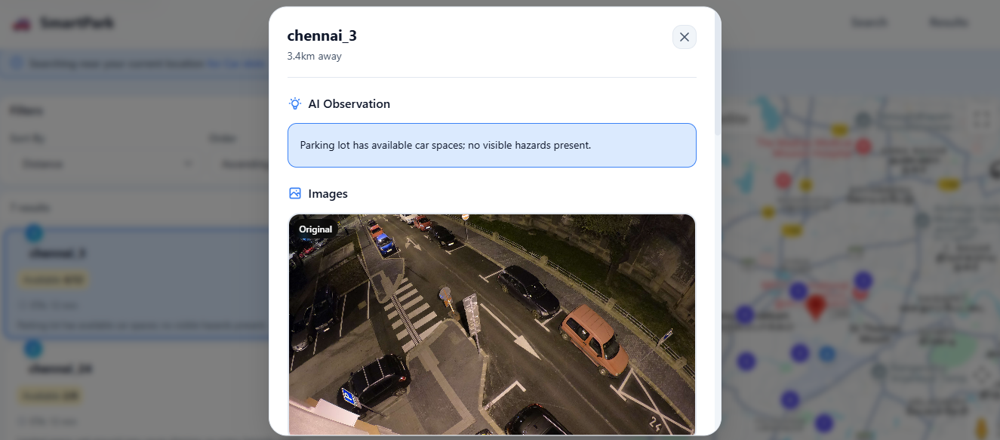
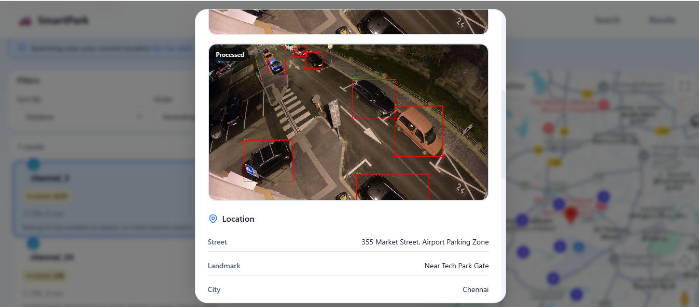
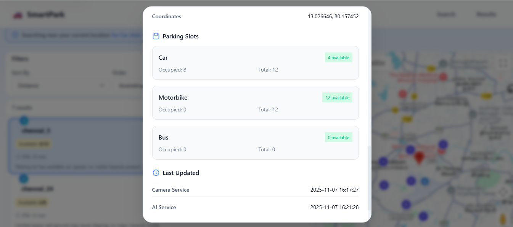

# 🚗 Smart Parking System

> Vision-based Smart Parking solution for metropolitan cities using **IoT + AI + Cloud + Microservices + Multimodal LLMs**.

  

---

### 🧠 Overview
A **vision-based smart parking system** that uses camera modules and edge processing to detect available parking spaces in real time.  
It integrates a **multimodal Large Language Model (LLM)** capable of processing both **images and text** to provide **context-aware reasoning and insights** — such as summarizing parking lot scene and generating vacant slot count.

---

### ⚡ Key Highlights
- 🚘 Real-time vehicle detection using **YOLO**  
- 🧩 Edge computation on **Raspberry Pi** with image processing  
- ☁️ **Microservices-based backend** using Spring Boot, Python & Kafka  
- 🧠 **Multimodal LLM reasoning (vision + text)** integrated via **Spring AI + OpenAI API**  
- 🔗 Event-driven communication via **Kafka**  
- 🗄️ **MongoDB + AWS S3** for scalable storage  
- 🌐 **Angular** web portal displaying real-time parking slot availability  

---

### 📋 Contents
- [Problem Statement](#problem-statement)
- [Solution Proposed](#solution-proposed)
- [Segments Involved](#segments-involved)
- [Technical Stack](#technical-stack)
- [Multimodal LLM Integration](#multimodal-llm-integration)
- [Flowchart of System](#flowchart-of-system)
- [Gallery](#gallery)

---

## 🧩 Problem Statement
- Parking is a persistent challenge in urban areas, leading to congestion and fuel waste.  
- Drivers often struggle to find available parking spaces, increasing traffic and pollution.  
- Existing systems provide static or inaccurate data that fails to reflect real-time parking availability.  
- There is a need for a **scalable, intelligent, and automated** parking monitoring system.  

---

## 💡 Solution Proposed
- **ESP32-CAM modules** are deployed in parking areas to stream real-time images.  
- A **Raspberry Pi** acts as a decentralized processing node for local image computation.  
- **YOLO-based object detection** identifies occupied slots.  
- Processed data flows through **Kafka** to microservices that manage cloud data updates.  
- A **multimodal LLM** interprets visual and textual data to generate **natural-language summaries and vacant slots info** utilizing the info obtained from the YOLO.  
- The **Angular web application** displays current slot availability and summaries.  

---

## 🧱 Segments Involved
- **Edge Computing:** Raspberry Pi for localized image analysis and networking.  
- **IoT Layer:** ESP32-CAM modules for live data capture.  
- **Cloud Layer:** Spring Boot and Python microservices for computation and storage.  
- **AI Layer:** LLM reasoning for intelligent interpretation and reporting.  
- **Frontend Layer:** Angular dashboard with live updates and visual data.  

---

## ⚙️ Flowchart of System

  

---

## 🧰 Technical Stack

### 🖥️ Processing Server
- Raspberry Pi 4B running Raspbian OS  
- TCP socket communication  
- Python (OpenCV, PIL) for local processing  

### 📸 ESP32-CAM Setup
- Arduino IDE (ESP32 Board)  
- TCP Protocol for image transfer  
- Lightweight streaming  

### 🌐 Frontend
- Angular  
- Google Maps API integration  

### 🧩 Microservices Architecture

| Service | Description | Tech Stack |
|----------|--------------|-------------|
| `camera-service` | YOLO-based image detection and upload | Python, OpenCV, Kafka, AWS S3 |
| `ai-service` | **Multimodal LLM-based reasoning (vision + text)** for interpreting detection data | Java, Spring Boot, Spring AI (OpenAI API), Kafka |
| `datafetch-service` | Fetches processed data for the frontend | Java, Spring Boot, MongoDB, AWS S3 |
| `db-writes-service` | Writes occupancy data to the database | Java, Spring Boot, Kafka, MongoDB |

---

## 🧠 Multimodal LLM Integration

The **AI service** leverages a **multimodal Large Language Model (LLM)** to combine **image-based insights (from YOLO)** with **textual and metadata context** for advanced interpretation and reporting.

### 💬 Capabilities
- **Visual + Text Fusion:** Combines YOLO outputs (detected vehicle counts, slot counts) with contextual information.  
- **Natural Language Reporting:** > Example: “Limited space; clear but slightly crowded with no visible hazards.”   

### 🧩 Powered by
- **Spring AI**  
- **OpenAI Multimodal API (vision + text)**  
- Integrated within the `ai-service` microservice  

---

## ☁️ Storage
- **AWS S3:** For storing camera feed images and processed snapshots.  
- **MongoDB:** For storing real-time occupancy and metadata.  

---

## 🖼️ Gallery

### 🔹 ESP32-CAM Module

  
  
  

### 🔹 Object Detection (YOLO)

  

### 🔹 Website Interface

  
  
  
  
  
  

---

## 🚀 Future Improvements
- Integration with mobile app for navigation to nearest available slot.  
- Heatmap visualization of parking usage trends.  
- License plate recognition (LPR) for automation and access control.  
- **Enhanced multimodal LLM prompts for deeper contextual analytics.**  

---

## 👩‍💻 Contributors
- [@greesh02](https://github.com/greesh02)
- [@YourTeamMembersHere]

---

## 📄 License
This project is licensed under the **MIT License** — free to use and modify with attribution.

---
